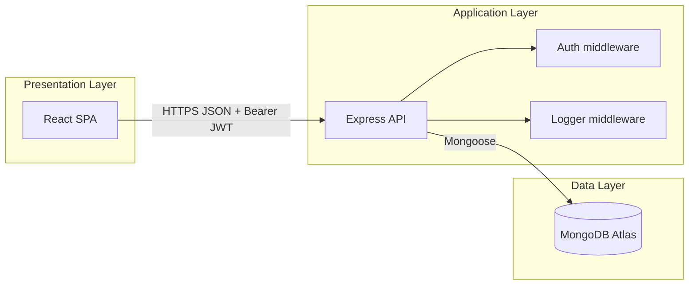

# Technical Report: Investment Simulator (MERN)

**Course:** Full Stack FinTech System  
**Project:** Investment Simulator with simulation logic and basic data model  
**Stack:** MongoDB, Express.js, React (Create React App), Node.js  

This document describes the problem, architecture, database design, core simulation logic, example queries, security choices, and scalability limits of the deployed system.

---

## 1. Problem Definition

### 1.1 What is an Investment Simulator?

An **investment simulator** is a software tool that takes user inputs such as starting balance, regular contributions, expected annual return, time horizon, and a simple risk setting. It then **projects** how money might grow over time using rules that approximate compound growth and optional variability. The output is not a guarantee of real market returns; it is a **planning aid** so users can see orders of magnitude and compare scenarios.

### 1.2 What problem does it solve?

Many people struggle to picture how small monthly savings compound over years. Spreadsheets work, but a dedicated web app:

- Collects inputs in one place  
- Runs consistent formulas on the server  
- Stores past runs so users can revisit them  
- Shows a **year-by-year breakdown** for explanation and defense  

This project solves **visualization and planning**: users can ask “if I save X per month at roughly Y% for Z years, what might the balance look like?” without manual calculation errors.

### 1.3 Target users

- **Individual investors** learning basics of long-term saving  
- **Students** studying personal finance or introductory FinTech courses  
- **Instructors** who need a small, explainable codebase for demos  

---

## 2. System Architecture

### 2.1 MERN overview

| Layer | Technology | Role |
|--------|------------|------|
| Data | MongoDB Atlas | Persistent storage for users and simulations |
| API | Express.js | REST endpoints, validation, JWT auth, simulation engine |
| Client | React (CRA) | Pages, forms, lists, results; `fetch` in event handlers |
| Runtime | Node.js | Runs Express and connects to MongoDB via Mongoose |

### 2.2 High-level diagram



### 2.3 Request flow (typical simulation create)

1. User fills the simulation form on the **Dashboard** and submits.  
2. React runs an **event handler** that calls `fetch()` to `POST /api/simulations` with JSON body and `Authorization: Bearer <token>`.  
3. Express receives the request. **Auth middleware** verifies the JWT and attaches `req.user`.  
4. The **simulations route** validates input, runs `runSimulation()`, builds a Mongoose document, and saves it.  
5. MongoDB stores the document; the API returns **201** with the saved simulation including embedded `results`.  
6. React updates **state** (no `useEffect` for loading; user clicks **Load My Simulations** when needed).  
7. User selects a row to view **SimResult** (totals + yearly table).  

### 2.4 Deployment layout (as implemented)

- **Backend:** hosted on Render; exposes REST API (e.g. root responds with a simple health string).  
- **Frontend:** hosted on Vercel (or Netlify); build is CRA; API base URL supplied via `REACT_APP_API_URL` in the host’s environment.  
- **Database:** MongoDB Atlas; connection string provided only via server environment variables (`MONGO_URI`), not committed to Git.  

---

## 3. Database Design

### 3.1 Collections

The assignment **basic** complexity allows one business collection **`simulations`** plus **`users`** for authentication.

### 3.2 Schema summary (tables)

**Collection: `users`**

| Field | Type | Notes |
|--------|------|--------|
| `_id` | ObjectId | Primary key |
| `name` | String | Required |
| `email` | String | Required, unique |
| `password` | String | Required; stored **hashed** (bcryptjs) |
| `createdAt` | Date | Default now |

**Collection: `simulations`**

| Field | Type | Notes |
|--------|------|--------|
| `_id` | ObjectId | Primary key |
| `userId` | ObjectId | Required; references `User` |
| `initialAmount` | Number | Required |
| `monthlyContribution` | Number | Required (may be 0) |
| `annualRate` | Number | Annual percent, e.g. 7 means 7% |
| `years` | Number | Horizon; validated (e.g. cap 50) |
| `riskLevel` | String | Enum: `low`, `medium`, `high` |
| `results` | Subdocument | See below |
| `createdAt` | Date | Default now |

**Subdocument: `results`**

| Field | Type | Notes |
|--------|------|--------|
| `totalInvested` | Number | Principal + all monthly contributions |
| `projectedValue` | Number | Balance after simulation |
| `gainLoss` | Number | `projectedValue - totalInvested` |
| `yearlyBreakdown` | Array | `{ year, value, invested }` per year |

### 3.3 Referencing vs embedding (justification)

- **Users and simulations — referencing:** One user can own **many** simulations over time. Storing all simulations inside the user document would grow without bound and could approach MongoDB’s **16 MB document limit**. Referencing keeps the user document small and allows queries like “all simulations for this user, newest first” without loading unrelated user fields.  

- **Results inside simulation — embedding:** The computed breakdown is **always** shown with that simulation. It is a bounded, structured blob. A separate collection would mean extra queries and joins for no real benefit at this scale.  

---

## 4. Core Logic Explanation

### 4.1 Purpose

The **core FinTech logic** is the `runSimulation` routine used when creating a simulation. It must be **visible in the backend** (in the route module) and **explainable** in defense.

### 4.2 Step-by-step algorithm

1. **Inputs:** `initial`, `monthly`, annual `rate` (%), `years`, and `risk` (`low` / `medium` / `high`).  
2. **Risk adjustment of rate:**  
   - `low`: effective annual rate = `rate * 0.8`  
   - `medium`: `rate` unchanged  
   - `high`: `rate * 1.2`  
3. **Monthly rate:** `adjustedRate / 100 / 12`.  
4. **Monthly loop:** For each month, apply compound growth on the current balance, then add the monthly contribution. Track **totalInvested** as initial plus every contribution.  
5. **Year-end volatility:** After each full year, multiply balance by `(1 + volatility)` where volatility is a small random band depending on risk (simulation “noise”).  
6. **Yearly snapshot:** Push `{ year, value, invested }` into `yearlyBreakdown`.  
7. **Outputs:** Rounded `totalInvested`, `projectedValue`, `gainLoss`, and the breakdown array.  

### 4.3 Worked example (medium risk)

**Inputs:** $1,000 initial, $100/month, **7%** annual, **5** years, **medium** risk.

- Adjusted rate stays **7%**.  
- Monthly rate \(\approx 7 / 100 / 12\).  
- Each month: balance compounds, then $100 is added.  
- After each year, a small random volatility adjustment is applied (medium band).  
- **Total invested** after 5 years: \(1000 + 100 \times 12 \times 5 = 7000\) dollars contributed (plus initial already counted in the loop logic).  
- **Projected value** is typically **above** $7,000 because of compounding; exact number depends on the random year-end shocks.  
- **Gain/loss** = projected value minus total invested.  

This example is useful in defense: you can narrate **contributions vs growth** and why the curve is not linear.

---

## 5. Query Explanation

### 5.1 Query 1 — List current user’s simulations (filter + sort)

**Intent:** Show only simulations belonging to the logged-in user, **newest first**.

**Mongoose-style query:**

```js
Simulation.find({ userId: req.user.id }).sort({ createdAt: -1 })
```

**Sample idea:** If user `U1` created sim `A` yesterday and sim `B` today, the array returns `[B, A]`. This supports the dashboard list without leaking other users’ data.

### 5.2 Query 2 — Aggregation by risk level (ranking / analytics)

**Intent:** Compare **average gain/loss** across risk buckets (defense / report depth).

**MongoDB aggregation example:**

```js
db.simulations.aggregate([
  { $group: {
      _id: "$riskLevel",
      avgReturn: { $avg: "$results.gainLoss" },
      count: { $sum: 1 }
  }}
])
```

**Sample interpretation:** If `high` simulations average higher `gainLoss` in backtests, that reflects **higher assumed rate and volatility** in this toy model—not a promise of real markets.

### 5.3 On-the-fly “query transformation”

When `POST /api/simulations` runs, the server **computes** `results` before insert. That is a form of **server-side transformation**: raw inputs become stored analytics fields (`projectedValue`, `gainLoss`, breakdown).

---

## 6. Security Analysis

### 6.1 Implemented measures (minimum set)

1. **Input validation (frontend + backend)**  
   - Frontend: empty checks, password length on signup, numeric sanity on simulation form.  
   - Backend: presence checks, email shape check on signup, positive numeric rules, max years.  
   This satisfies “validation on forms and API endpoints.”  

2. **Protected routes (frontend + backend)**  
   - Frontend: dashboard route requires a token in `localStorage`; otherwise navigate to login.  
   - Backend: JWT middleware on `/api/simulations` routes; missing/invalid token returns **401** with a consistent message shape.  

3. **Password hashing**  
   - Passwords are hashed with **bcryptjs** before `User` documents are saved. Login compares with `bcrypt.compare`.  

### 6.2 JWT model (short)

On signup/login the API returns a JWT signed with `JWT_SECRET` and expiry (e.g. one hour). The client stores it and sends `Authorization: Bearer …` on protected calls. Middleware verifies signature and extracts `userId`.

### 6.3 Why this level of security

These choices match **introductory full-stack** scope: understandable, easy to demonstrate live, and sufficient for a classroom FinTech prototype. They are **not** a complete production security program (no rate limiting, no advanced hardening in this brief).

### 6.4 Known weakness to mention in defense

If **secrets leak** (e.g. `.env` committed or shared), attackers could forge JWTs. Mitigation: keep secrets only in hosting env vars, use long random secrets, rotate after leaks, and never commit `.env`.

---

## 7. Scalability Discussion

### 7.1 What breaks around 10,000 active users?

- **Database:** Atlas tier limits, connection pool pressure, and lack of indexing strategy at scale.  
- **Single API instance:** One Render/Railway web service becomes CPU-bound on simulation CPU work and JSON serialization.  
- **No caching:** Repeated reads of simulation lists hit Mongo every time.  
- **No pagination:** Large histories mean large JSON payloads and slow dashboards.  
- **Frontend delivery:** Without a CDN strategy tuned for assets, global latency can hurt (hosting platforms partially help, but caching headers and splitting matter at scale).  

### 7.2 Practical improvements

- **Indexes:** `{ userId: 1, createdAt: -1 }` for the main list query.  
- **Pagination:** `limit` / `skip` or cursor-based pagination on `GET /api/simulations`.  
- **Caching:** Cache hot read patterns (e.g. last N simulations) with Redis if course scope allows later.  
- **Horizontal scale:** Multiple Node instances behind a load balancer; sticky sessions not required for JWT APIs.  
- **Tier upgrades:** Move Atlas and hosting off free tiers for SLA and capacity.  

### 7.3 Scope honesty

This project prioritizes **clarity and grading requirements** over microservice architecture, advanced observability, or financial-grade compliance. That is appropriate for the assignment while still supporting a serious scalability conversation.

---

## Appendix A — API surface (summary)

| Method | Path | Auth | Purpose |
|--------|------|------|---------|
| POST | `/api/auth/signup` | No | Register; returns JWT |
| POST | `/api/auth/login` | No | Login; returns JWT |
| POST | `/api/simulations` | Yes | Create + compute + save |
| GET | `/api/simulations` | Yes | List for user |
| GET | `/api/simulations/:id` | Yes | Fetch one |
| DELETE | `/api/simulations/:id` | Yes | Remove one |

---

## Appendix B — Frontend pages (rubric alignment)

- **Login** — obtain token  
- **Signup** — register and obtain token  
- **Dashboard** — create simulation, load list on button click, select row for details, delete  

---

*End of technical report.*
